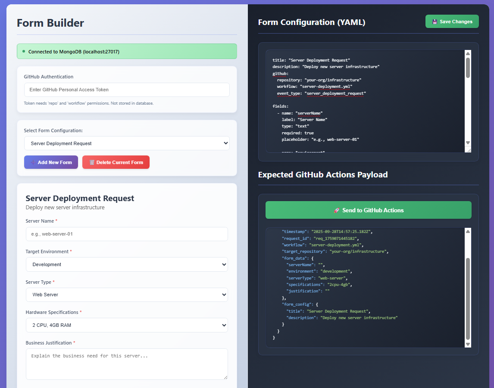

<p align="center">
  
</p>

<h1 align="center">📝Dynamic Form Builder📝</h1>

A containerized form builder that generates dynamic forms from YAML configurations and dispatches automation workflows via GitHub Actions. Designed to bridge the gap between development teams and enterprise form management systems.

## Problem Statement

Enterprise organizations often face coordination challenges between development teams building automation workflows and specialized form creation teams managing platforms like ServiceNow, Sailpoint, and other ITSM tools. This disconnect can result in:

- Development bottlenecks waiting for form creation resources
- Misaligned requirements between technical implementations and user-facing forms
- Extended time-to-market for automation initiatives
- Limited ability to prototype and test form-driven workflows

## Solution

Form Builder that provides a self-service prototyping environment that enables development teams to:

- **Rapidly prototype forms** using intuitive YAML configuration
- **Test automation workflows** with realistic form data structures
- **Generate standardized specifications** for enterprise form creation teams
- **Maintain development velocity** while formal forms are being developed

The platform serves as a communication bridge, allowing developers to create functional prototypes that can be easily translated into production forms by specialized teams when resources become available.

## Key Benefits

### For Development Teams
- Immediate form prototyping without dependencies
- Real-time testing of GitHub Actions workflows
- Standardized YAML format for consistent specifications
- MongoDB integration for persistent configuration management

### For Form Creation Teams
- Clear, structured requirements in YAML format
- Pre-tested form logic and field relationships
- Reduced back-and-forth during requirements gathering
- Seamless translation path to enterprise platforms

### For Organizations
- Accelerated automation delivery
- Improved collaboration between technical and operational teams
- Reduced coordination overhead
- Enhanced quality through early prototyping

## Architecture

- **Frontend**: Single-page application with dynamic form rendering
- **Backend**: Flask API with MongoDB integration
- **Integration**: Direct GitHub Actions workflow dispatch
- **Configuration**: Human-readable YAML specifications

## Workflow

1. **Prototype**: Developers create and test forms using YAML configuration
2. **Validate**: Test automation workflows with realistic form data
3. **Handoff**: Share validated YAML specifications with form creation teams
4. **Implement**: Form teams translate specifications to production platforms
5. **Deploy**: Seamless transition from prototype to production

## Using the interface

# Left Panel
- Database Status: Shows MongoDB connection status
- Github Autnehtication: Enter your Github Personal Access Token for workflow dispatch. For security purposes, this won't be saved to MongoDB and you'll have to enter it at the start of every session.
- Form Selection: Choose from existing forms or create a new one
  - Use "Add New Form" to create a custom form. It will initially be populated with examples of each type of question (multiple choice, dropdown, checkbox, etc.)
  - "Delete Current Form" removes the selected configuration
- Live Preview: See your form render in real-time as you edit the YAML

# Right Panel
- YAML Editor: Edit form configurations using YAML syntax. Use "Save to MongoDB" to persist changes"
- Github Actions Payload: 
  - View the exact JSON payload that will be sent to Github
  - Updates automatically as you fill out the form
  - Click "Send to Github Actions" to trigger your workflow

---

## YAML Schema Reference

Every form is defined by a YAML document stored in MongoDB. The YAML editor in the right panel accepts this format and renders the form live as you type.

### Top-level Structure

```yaml
title: "My Form Title"           # Displayed as the form heading
description: "Optional summary"  # Displayed below the heading (optional)

env:                             # Optional — form-level variables (see below)
  DT_API_KEY: "dt0c01.xxxx"
  DT_ENV_ID:  "abc123"

github:
  repository: "org/repo"         # GitHub repository to dispatch to
  workflow: "workflow-file.yml"  # Workflow file name
  event_type: "my_event_type"    # repository_dispatch event_type value

fields:
  - name: "fieldName"            # Unique key — used as the key in the payload
    label: "Field Label"
    type: "text"
    # ... see properties below
```

### Form-level Environment Variables (`env`)

The optional top-level `env` block lets you declare key/value pairs that are tied to a specific form. They are stored with the form in the database and are available to any `{{env:VAR}}` placeholder in `source.url` or `source.headers`.

```yaml
env:
  DT_API_KEY: "dt0c01.xxxx"
  DT_ENV_ID:  "abc123.live.dynatrace.com"
```

**Resolution order:** form-level `env` values take precedence over server environment variables with the same name. This means you can set a default on the server and override it per-form, or keep everything self-contained in the YAML.

**Security note:** values stored here are saved in plaintext in the database alongside the rest of the form configuration. This is suitable for internal tooling where database access is already restricted. For highly sensitive secrets, prefer server environment variables instead.

---

---

### Field Types

| Type | Description |
|---|---|
| `text` | Single-line text input |
| `email` | Email address input (format-validated by the browser) |
| `number` | Numeric input |
| `datetime-local` | Date and time picker |
| `textarea` | Multi-line text input |
| `dropdown` | Single-select dropdown — requires an `options` list |
| `checkbox` | Multi-select checkboxes — requires an `options` list; value in the payload is an array |

---

### Common Field Properties

| Property | Type | Required | Description |
|---|---|---|---|
| `name` | string | **Yes** | Unique identifier. Used as the key in the GitHub Actions payload. |
| `label` | string | **Yes** | Human-readable label displayed above the field. |
| `type` | string | **Yes** | One of the field types listed above. |
| `required` | boolean | No | Marks the field as mandatory. Default: `false`. |
| `placeholder` | string | No | Hint text displayed inside the input. |
| `default` | string / number | No | Pre-filled value on form load. |
| `note` | string | No | Helper text rendered below the field with a 💡 icon. |
| `show_if` | object | No | Conditional visibility rule — see [Conditional Logic](#conditional-logic-show_if) below. |

#### Type-specific Properties

| Property | Types | Description |
|---|---|---|
| `min` | `number` | Minimum allowed value. |
| `max` | `number` | Maximum allowed value. |
| `options` | `dropdown`, `checkbox` | List of selectable choices — required for these types. |

---

### Options (dropdown and checkbox)

Both `dropdown` and `checkbox` require an `options` list. Each entry has two keys:

```yaml
options:
  - value: "payload_value"    # Value written to the GitHub Actions payload
    label: "Displayed label"  # Text shown to the user in the UI
  - value: "another_value"
    label: "Another Choice"
```

---

### Dynamic Options (`source`)

Use `source` instead of `options` to populate a `dropdown` or `checkbox` field from a live API GET request. The request is made **server-side** via the `/api/proxy` endpoint — tokens never reach the browser or the database.

```yaml
- name: "managementZone"
  label: "What MZ are we adding the entity into?"
  type: "dropdown"
  required: true
  source:
    url: "https://{{env:DT_ENV_ID}}.live.dynatrace.com/api/v2/managementZones"
    headers:
      Authorization: "Api-Token {{env:DT_API_TOKEN}}"
    path: "managementZones"   # dot-notation path to the array in the response body
    value: "id"               # field of each item used as the payload value
    label: "name"             # field of each item displayed in the UI
```

**`source` properties:**

| Property | Required | Description |
|---|---|---|
| `url` | **Yes** | Full URL of the GET endpoint. |
| `headers` | No | HTTP headers map. Values may contain `{{env:VAR_NAME}}` which is resolved from a server environment variable at request time. |
| `path` | No | Dot-notation path to the array inside the JSON response (e.g. `managementZones` or `data.items`). Omit if the response root is already an array. |
| `value` | No | Field of each array item to use as the option value in the payload. Omit to use the whole item. |
| `label` | No | Field of each array item to display in the UI. Omit to use the whole item. |

**Token security:** set your token as a server environment variable (e.g. `export DT_API_TOKEN=dt0c01.xxx`) and reference it with `{{env:DT_API_TOKEN}}` in the YAML header. The placeholder is resolved on the server; the raw token is never stored in the database or sent to the browser.

**Loading behaviour:** the field renders in a disabled "Loading…" state while the request is in flight, then populates automatically. If the request fails, an inline error message is shown inside the field.

---

### Conditional Logic (`show_if`)

A field with `show_if` is **hidden** until its condition is met. When a field becomes hidden again, its value is **cleared and excluded from the payload** — stale data never reaches GitHub Actions.

```yaml
show_if:
  field: "sourceFieldName"   # name of the field to watch
  operator: "equals"         # comparison operator (optional, defaults to "equals")
  value: "targetValue"       # value to match (not required for not_empty)
```

#### Operators

| Operator | Best for | Behaviour |
|---|---|---|
| `equals` *(default)* | `dropdown`, `text` | Visible when source value exactly matches `value`. |
| `not_equals` | `dropdown`, `text` | Visible when source value does **not** match `value`. |
| `contains` | `checkbox`, `text` | Visible when a checkbox selection includes `value`, or a text field contains the substring. |
| `not_empty` | any | Visible when source field has any non-empty value. `value` is not required. |

#### Chaining

A conditional field can itself be the source of another `show_if`, creating multi-level chains:

```yaml
fields:
  - name: "enableAdvanced"
    label: "Enable Advanced Options"
    type: "dropdown"
    options:
      - value: "yes"
        label: "Yes"
      - value: "no"
        label: "No"

  - name: "advancedMode"
    label: "Advanced Mode"
    type: "dropdown"
    show_if:
      field: "enableAdvanced"
      operator: "equals"
      value: "yes"
    options:
      - value: "readonly"
        label: "Read-only"
      - value: "readwrite"
        label: "Read / Write"

  - name: "writeConfirmation"
    label: "Confirm Write Access"
    type: "text"
    required: true
    placeholder: "Type CONFIRM to proceed"
    show_if:
      field: "advancedMode"   # depends on a field that is itself conditional
      operator: "equals"
      value: "readwrite"
```

---

### Complete Example

```yaml
title: "Access Request"
description: "Request access to a system or environment"

github:
  repository: "my-org/automation-repo"
  workflow: "access-request.yml"
  event_type: "access_request_automation"

fields:
  - name: "requestorName"
    label: "Your Name"
    type: "text"
    required: true
    placeholder: "First Last"

  - name: "environment"
    label: "Target Environment"
    type: "dropdown"
    required: true
    options:
      - value: "development"
        label: "Development"
      - value: "staging"
        label: "Staging"
      - value: "production"
        label: "Production"

  - name: "productionApprover"
    label: "Production Approver"
    type: "text"
    required: true
    placeholder: "Manager's full name"
    note: "All production requests require manager approval"
    show_if:
      field: "environment"
      operator: "equals"
      value: "production"

  - name: "accessLevel"
    label: "Access Level"
    type: "dropdown"
    required: true
    options:
      - value: "read"
        label: "Read-only"
      - value: "write"
        label: "Read / Write"
      - value: "admin"
        label: "Admin"

  - name: "justification"
    label: "Admin Justification"
    type: "textarea"
    required: true
    placeholder: "Explain why admin access is needed..."
    show_if:
      field: "accessLevel"
      operator: "equals"
      value: "admin"

  - name: "notifyTeams"
    label: "Notify Teams"
    type: "checkbox"
    options:
      - value: "security"
        label: "Security"
      - value: "compliance"
        label: "Compliance"

  - name: "complianceTicket"
    label: "Compliance Ticket Number"
    type: "text"
    required: true
    placeholder: "e.g. COMP-1234"
    show_if:
      field: "notifyTeams"
      operator: "contains"
      value: "compliance"

  - name: "startDate"
    label: "Access Start Date"
    type: "datetime-local"
    required: true

  - name: "notes"
    label: "Additional Notes"
    type: "textarea"
    placeholder: "Any other context..."
    note: "This field is optional"
```

---

---

## Standalone Mode (No Docker)

If you don't want to run Docker or MongoDB, a single-file alternative server is included. It serves the frontend, exposes the same `/api/*` endpoints, and stores all form data in a local `forms.json` file.

```bash
# Install dependencies (Flask + Requests — that's it)
pip install -r requirements-standalone.txt

# Run
python standalone.py
# → http://localhost:8080
```

The `forms.json` file is created automatically on first use and lives in the project root. It's plain JSON — you can open it in any editor. Writes are atomic (temp-file + rename) so a crash mid-save won't corrupt your data.

**Environment variables:**

| Variable | Default | Description |
|---|---|---|
| `PORT` | `8080` | Port the server listens on |
| `FORMS_FILE` | `forms.json` | Path to the JSON storage file |

---

## Quick Start
```bash
# Clone the repository
git clone https://github.com/MBarc/dynamic-form-builder.git
cd dynamic-form-builder

# Start infrastructure
docker-compose up -d 

# Access the application
# Frontend: http://localhost:8080
# MongoDB Express: http://localhost:8081 (optional database GUI)
```
